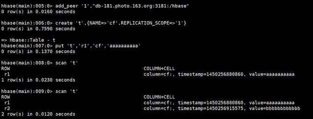

# hbase

1. HBase高可用实现
    * 参考网址：https://blog.csdn.net/vcould163/article/details/51487935
    * HBase的高可用不支持DDL操作.
        * 换句话说，在master上的DDL操作，不会影响到slave上的数据，所以即使在master上进行了DDL操作，slave上的数据依然没有变化。
    
    * 复制模式
        * Master-Slave 复制比较简单，所有在Master集群上写入的数据都会被同步到Slave上。
        * Master-Master复制与Master-Slave类似，主要的不同在于，在Master-Master复制中，两个Master地位相同，都可以进行读取和写入。
    
    * M-M模式搭建
        * 在两台Master上都执行
           ```
           add_peer '1', "hbase-hostx:2181:/hbase"
           ```
          
          


