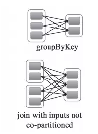
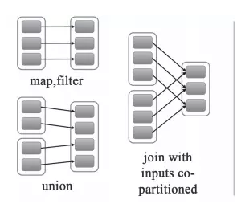

# spark

1. spark-submit 资源分配

      硬件资源： 6 节点，每个节点16 cores, 64 GB 内存
      
      每个节点在计算资源时候，给操作系统和Hadoop的进程预留1core，1GB，所以每个节点剩下15个core和63GB内存。
      
    * core的个数，决定一个executor能够并发任务的个数。所以通常认为，一个executor越多的并发任务能够得到更好的性能，
    但有研究显示一个应用并发任务超过5，导致更差的性能。所以core的个数暂设置为5个。
    5个core是表明executor并发任务的能力，并不是说一个系统有多少个core，即使我们一个CPU有32个core，也设置5个core不变。
    
    * executor个数，接下来，一个executor分配 5 core,一个node有15 core，从而我们计算一个node上会有3 executor（15 / 5），
    然后通过每个node的executor个数得到整个任务可以分配的executors个数。
    我们有6个节点，每个节点3个executor，6 × 3 = 18个executors，额外预留1个executor给AM，最终要配置17个executors。
    
      最后spark-submit启动脚本中配置 –num-executors = 17
    * memory，配置每个executor的内存，一个node，3 executor， 63G内存可用，所以每个executor可配置内存为63 / 3 = 21G
      从Spark的内存模型角度，Executor占用的内存分为两部分：ExecutorMemory和MemoryOverhead，预留出MemoryOverhead的内存量之后，
      才是ExecutorMemory的内存。
      MemoryOverhead的计算公式： max(384M, 0.07 × spark.executor.memory)
      
      因此 MemoryOverhead值为0.07 × 21G = 1.47G > 384M
      
      最终executor的内存配置值为 21G – 1.47 ≈ 19 GB
      
      至此， Cores = 5, Executors= 17, Executor Memory = 19 GB

2. 宽依赖、窄依赖
    * 宽依赖：父RDD的每个分区都有可能被多个子RDD分区使用，子RDD分区通常对应父RDD所有分区
    
        
    
    * 窄依赖：父RDD的每个分区只被一个子RDD分区使用，子RDD分区通常只对应常数个父RDD分区
    
        

    * 对比：
        * 宽依赖往往对应着shuffle操作，需要在运行的过程中将同一个RDD分区传入到不同的RDD分区中，
        中间可能涉及到多个节点之间数据的传输，而窄依赖的每个父RDD分区通常只会传入到另一个子RDD分区，通常在一个节点内完成。
        * 当RDD分区丢失时，对于窄依赖来说，由于父RDD的一个分区只对应一个子RDD分区，
        这样只需要重新计算与子RDD分区对应的父RDD分区就行。这个计算对数据的利用是100%的
        * 当RDD分区丢失时，对于宽依赖来说，重算的父RDD分区只有一部分数据是对应丢失的子RDD分区的，另一部分就造成了多余的计算。
        宽依赖中的子RDD分区通常来自多个父RDD分区，极端情况下，所有父RDD都有可能重新计算。
    * 对应函数
        * 窄依赖的函数有：
        
           map, filter, union, join(父RDD是hash-partitioned ), mapPartitions, mapValues
           
        * 宽依赖的函数有：
        
          groupByKey, join(父RDD不是hash-partitioned ), partitionBy

3. RDD、DataFrame、Dataset
    * spark基本算子，一个只读的分区记录集合。包含两种操作：transformation 和 action，其中transformation属于惰性操作。
    * RDD、DataFrame、Dataset的差异：
    
        * 相同点：
            * RDD、DataFrame、Dataset全都是spark平台下的分布式弹性数据集，为处理超大型数据提供便利
            * 三者都有惰性机制
            * 三者都会根据spark的内存情况自动缓存运算，这样即使数据量很大，也不用担心会内存溢出
            * 三者都有partition的概念和共同的函数，如filter，排序等
            * DataFrame和Dataset均可使用模式匹配获取各个字段的值和类型
        
        * 不同点：
            * RDD
                * RDD一般和spark mlib同时使用
                * RDD不支持sparksql操作
            * DataFrame
                * 与RDD和Dataset不同，DataFrame每一行的类型固定为Row，只有通过解析才能获取各个字段的值，如
                  ```
                  testDF.foreach{
                    line =>
                      val col1=line.getAs[String]("col1")
                      val col2=line.getAs[String]("col2")
                  }
                  ```
                * DataFrame与Dataset一般与spark ml同时使用
                * DataFrame与Dataset均支持sparksql的操作，比如select，groupby之类，还能注册临时表/视窗，进行sql语句操作
                  ```
                  dataDF.createOrReplaceTempView("tmp")
                  spark.sql("select  ROW,DATE from tmp where DATE is not null order by DATE").show(100,false)
                  ```
                * DataFrame与Dataset支持一些特别方便的保存方式，比如保存成csv，可以带上表头，这样每一列的字段名一目了然
                  ```
                  //保存
                  val saveoptions = Map("header" -> "true", "delimiter" -> "\t", "path" -> "hdfs://172.xx.xx.xx:9000/test")
                  datawDF.write.format("com.databricks.spark.csv").mode(SaveMode.Overwrite).options(saveoptions).save()
                  //读取
                  val options = Map("header" -> "true", "delimiter" -> "\t", "path" -> "hdfs://172.xx.xx.xx:9000/test")
                  val datarDF= spark.read.options(options).format("com.databricks.spark.csv").load()
                  ```
            * Dataset
                * DataFrame也可以叫Dataset[Row],每一行的类型是Row
    * 相互转化
        * DataFrame/Dataset转RDD
          ```
          val rdd1=testDF.rdd
          val rdd2=testDS.rdd
          ```
        * RDD转DataFrame
          ```
          import spark.implicits._
          val testDF = rdd.map {line=>
                (line._1,line._2)
              }.toDF("col1","col2")
          ```
        * RDD转Dataset
          ```
          import spark.implicits._
          case class Coltest(col1:String,col2:Int)extends Serializable //定义字段名和类型
          val testDS = rdd.map {line=>
                Coltest(line._1,line._2)
              }.toDS
          ```
        * Dataset转DataFrame
          ```
          import spark.implicits._
          val testDF = testDS.toDF
          ```
        * DataFrame转Dataset
          ```
          import spark.implicits._
          case class Coltest(col1:String,col2:Int)extends Serializable //定义字段名和类型
          val testDS = testDF.as[Coltest]
          ```
        
4. wordcount

    
