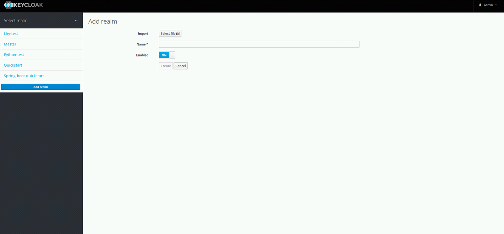

# KEYCLOAK 配置文档

### 1.创建REALM


### 2.配置CLIENT
将localhost和端口换成相应的应用服务器地址和端口即可，其他保持一致
创建三个角色，login，admin和user
创建两个用户lhy和lei分别赋予admin和user角色

### 3.查看SECRET

### 4.在SPRING配置文件APPLICATION.PROPERTIES中写入以下配置
```
# realm名称
keycloak.realm=lhy-test

# keycloak安装服务器的IP和端口
keycloak.auth-server-url=http://192.168.110.45:8180/auth

keycloak.ssl-required=external

# clientID名称
keycloak.resource=test

keycloak.public-client=false

# keycloak client 加密字段，获取方式见图3
keycloak.credentials.secret=e57d2022-9e67-48db-8507-ca2ccf78cf18

# 给予所有资源访问必须要有登录角色的权限
keycloak.securityConstraints[0].authRoles[0] = login
keycloak.securityConstraints[0].securityCollections[0].patterns[0] = /*
# 此行配置必须加*号
```
### 5.项目示例
```
项目地址：https://github.com/leihongyang/keycloak-spring-boot-demo.git
需要将application.properties文件内容替换为需要的内容
访问Web服务地址，需要登录，输入带有login角色的用户能够登录。若该用户拥有admin角色就能访问管理员入口，拥有user角色能访问用户入口。

程序详解：（环境java1.8，maven3）
		1.引入keycloak-spring依赖
		<dependency>
			<groupId>org.keycloak</groupId>
			<artifactId>keycloak-spring-boot-starter</artifactId>
		</dependency>
		2.引入keycloak-adapter
		<dependencyManagement>
			<dependencies>
				<dependency>
					<groupId>org.keycloak.bom</groupId>
					<artifactId>keycloak-adapter-bom</artifactId>
					<version>${keycloak.version}</version>
					<type>pom</type>
					<scope>import</scope>
				</dependency>
			</dependencies>
			</dependencyManagement>
		3.参照第4节配置spring配置文件，至此程序已经交给keycloak管理了。其余详解见demo注释
```
